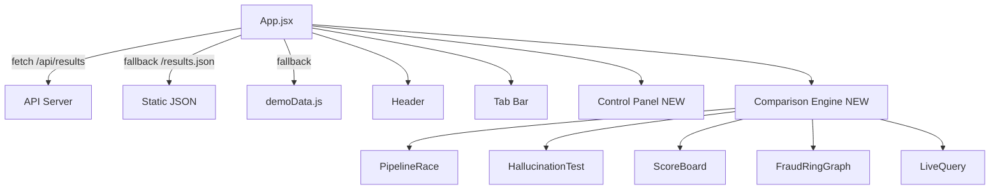

# Design Document

## Overview

The dashboard-ui-overhaul transforms the FraudGraph React/Vite SPA from a neon-heavy aesthetic into a refined "Deep Space" design system. The overhaul is purely cosmetic and structural — no backend changes, no data model changes, no new API endpoints. All existing functionality (Pipeline Race, Hallucination Test, Benchmark Results, Fraud Ring Graph, Live Query) is preserved verbatim.

The key deliverables are:

1. **New CSS design tokens** in `index.css` — replacing the current neon palette with the Deep Space palette (`#0B0E14` background, `#151921` surfaces, `#00F5FF` cyan, `#FF4D4D` crimson, `#FFB800` amber, `#2D333B` borders).
2. **Split-Pane Workbench layout** in `App.jsx` — a locked header, 30/70 two-column grid (Control Panel + Comparison Engine), responsive collapse at 900px.
3. **Ghost Button component** — outline-only style with fill-on-hover, used for Run Benchmark, Start Race, and Scan actions.
4. **Typewriter Effect hook** — `useTypewriter` custom hook that reveals text character-by-character at 18–22 chars/sec with a blinking cursor.
5. **Node-Expansion Animation** — staggered scale-in on first render of the Fraud Ring Graph, with a "seen" flag to prevent replay.
6. **JSON Syntax Highlighting component** — `EvidenceString` component that parses and color-codes graph evidence strings.
7. **Radial Gauge component** — SVG arc gauge replacing the existing `RadialBarChart` in the Benchmark Results tab.
8. **Pulse Line component** — animated vertical separator between Baseline and GraphRAG panes.

---

## Architecture

The application is a client-side React SPA with no server-side rendering. The architecture remains unchanged — this overhaul only touches the presentation layer.

```
fraudgraph/dashboard/src/
├── index.css                  ← Design tokens (MODIFIED: Deep Space palette)
├── main.jsx                   ← Entry point (unchanged)
├── App.jsx                    ← Root layout (MODIFIED: Split-Pane Workbench)
├── components/
│   ├── Header.jsx             ← (MODIFIED: Deep Space tokens, Ghost Button)
│   ├── PipelineRace.jsx       ← (MODIFIED: Ghost Button, Typewriter, Pulse Line)
│   ├── ScoreBoard.jsx         ← (MODIFIED: Radial Gauge, Deep Space tokens)
│   ├── FraudRingGraph.jsx     ← (MODIFIED: Node-Expansion Animation)
│   ├── HallucinationTest.jsx  ← (MODIFIED: Deep Space tokens, EvidenceString)
│   ├── LiveQuery.jsx          ← (MODIFIED: Ghost Button, Deep Space tokens)
│   ├── EvidenceModal.jsx      ← (MODIFIED: EvidenceString, Deep Space tokens)
│   ├── TokenTax.jsx           ← (MODIFIED: Deep Space tokens)
│   ├── GSQLTrace.jsx          ← (MODIFIED: Deep Space tokens)
│   ├── GhostButton.jsx        ← NEW: reusable Ghost Button
│   ├── RadialGauge.jsx        ← NEW: SVG arc gauge
│   ├── EvidenceString.jsx     ← NEW: JSON syntax highlighting
│   └── PulseLine.jsx          ← NEW: animated vertical separator
└── hooks/
    └── useTypewriter.js       ← NEW: typewriter effect hook
```

### Data Flow

Data flow is unchanged. `App.jsx` fetches from `/api/results` → falls back to `/results.json` → falls back to `DEMO_DATA`. The `summary` and `records` props are passed down to each tab component exactly as before.



---

## Components and Interfaces

### 1. Design Token Updates (`index.css`)

Replace the current CSS custom properties with the Deep Space palette. The existing variable names are preserved where semantically equivalent to avoid cascading renames across all components.

**Token mapping:**

| Old token | New value | Purpose |
|---|---|---|
| `--bg` | `#0B0E14` | Root page background |
| `--bg2` | `#0D1117` | Secondary background |
| `--surface` | `#151921` | Card/panel background |
| `--surface2` | `#1C2128` | Elevated surface |
| `--surface3` | `#21262D` | Further elevated |
| `--surface4` | `#2D333B` | Highest surface |
| `--border` | `#2D333B` | Default border |
| `--border2` | `#444C56` | Hover border |
| `--border3` | `#545D68` | Active border |
| `--red` | `#FF4D4D` | Crimson — fraud/suspicious |
| `--red2` | `#FF6B6B` | Lighter crimson |
| `--green` | `#00F5FF` | Electric Cyan — safe verdicts |
| `--green2` | `#48CAE4` | Lighter cyan |
| `--cyan` | `#00F5FF` | Electric Cyan (alias) |
| `--yellow` | `#FFB800` | Warning Amber |
| `--orange` | `#FFB800` | Warning Amber (alias) |
| `--text` | `#F0F6FF` | Primary text |
| `--text-dim` | `#8B949E` | Secondary text |
| `--text-muted` | `#484F58` | Muted text |

**Shadow system update:** All `box-shadow` values on non-interactive `.card` elements are replaced with `0 1px 3px rgba(0,0,0,0.4)` or removed entirely. Neon glow shadows (`--shadow-red`, `--shadow-green`, `--shadow-cyan`) are retained only for interactive elements (buttons, focused inputs).

**Border system update:** `.card` border changes from `1px solid var(--border)` (old `#162e4a`) to `1px solid #2D333B`. Hover/focus transitions to `#444C56` within 150ms via CSS transition.

### 2. `GhostButton.jsx` (new component)

```jsx
// Props
{
  children: ReactNode,
  accent: string,       // CSS color value, e.g. 'var(--red)'
  onClick: () => void,
  disabled?: boolean,
  fullWidth?: boolean,
}
```

Renders a `<motion.button>` with:
- Background: `transparent` at rest → `{accent}26` (15% opacity) on hover
- Border: `1px solid {accent}`
- Label color: `{accent}` at rest → `#FFFFFF` on hover
- `whileTap={{ scale: 0.97 }}`
- Transition: `background 150ms, color 150ms, border-color 150ms`

### 3. `useTypewriter.js` (new hook)

```js
// Signature
function useTypewriter(text: string, active: boolean): { displayed: string, done: boolean }
```

- When `active` becomes `true` and `text` changes, starts revealing characters at a random interval between `45ms` and `56ms` per character (≈ 18–22 chars/sec).
- Returns `{ displayed, done }` where `displayed` is the currently revealed substring.
- When `active` becomes `false` before completion, immediately sets `displayed = text` and `done = true`.
- Uses `useRef` for the interval handle to avoid stale closures.
- Cleans up the interval on unmount.

### 4. `PulseLine.jsx` (new component)

```jsx
// Props
{ active: boolean }
```

Renders a `<div>` that is:
- At rest: `width: 1px`, `background: #2D333B`, `height: 100%`
- When `active=true`: overlays a `<motion.div>` child with `height: 60px`, gradient `transparent → #00F5FF → transparent`, animating `top` from `-60px` to `100%` with `repeat: Infinity`, `duration: 1.2s`, `ease: 'linear'`.

### 5. `EvidenceString.jsx` (new component)

```jsx
// Props
{ text: string }
```

Parses a single evidence string and returns a `<span>` with inline color styling:

1. If text contains `ALERT`, `BLACKLISTED`, `banned`, or `flagged` → entire string in `#FF4D4D`
2. Else if text contains `clean`, `SAFE`, or `isolated` → entire string in `#00F5FF`
3. Else → tokenize on `:` or `=` separators; render key in `#00F5FF`, value in `#F0F6FF`
4. Prefix with `> ` rendered in `#444C56`

All text uses `font-family: var(--mono)`.

### 6. `RadialGauge.jsx` (new component)

```jsx
// Props
{
  value: number,      // 0–100
  label: string,
  size?: number,      // default 160
}
```

Renders an inline SVG:
- Arc from `135°` to `405°` (270° sweep) representing 0–100%
- Track arc: `#2D333B`
- Value arc color:
  - `value > 80` → `#00F5FF`
  - `value >= 50` → `#FFB800`
  - `value < 50` → `#FF4D4D`
- Center text: numeric value in JetBrains Mono (large), label below (small)
- Uses SVG `stroke-dasharray` / `stroke-dashoffset` for the arc fill

### 7. Split-Pane Workbench (`App.jsx` layout changes)

The current `App.jsx` renders a full-width content area. The new layout introduces:

```
┌─────────────────────────────────────────────────────┐
│  Header (position: fixed, z-index: 100)             │
├──────────────┬──────────────────────────────────────┤
│ Control Panel│ Comparison Engine                    │
│   (30%)      │   (70%)                              │
│              │  ┌──────────────────────────────┐    │
│ Account ID   │  │ Tab Bar (sticky within pane) │    │
│ Log Upload   │  ├──────────────────────────────┤    │
│ Run Benchmark│  │ Active Tab Content           │    │
│ (GhostButton)│  └──────────────────────────────┘    │
└──────────────┴──────────────────────────────────────┘
```

- The outer grid is `display: grid; grid-template-columns: 30% 70%`
- Below 900px: `grid-template-columns: 1fr` (stacked)
- The Control Panel is `position: sticky; top: [header height]` so it stays visible during scroll
- The tab bar moves inside the Comparison Engine column (still `position: sticky`)

### 8. Node-Expansion Animation (`FraudRingGraph.jsx`)

A `useRef` flag `hasAnimated` tracks whether the graph has been rendered before. On first render:
- Each node starts at `scale: 0` in the canvas draw loop
- Nodes animate to `scale: 1` over 300ms with 40ms stagger per node index
- The scale is applied via a per-node `animScale` value that increments each frame
- On subsequent renders (tab re-activation), `hasAnimated.current === true` → nodes render at full scale immediately

---

## Data Models

No new data models are introduced. The overhaul consumes the same `summary` and `records` shapes from `demoData.js` / the API.

### Existing shapes (unchanged)

```ts
interface Summary {
  total_accounts: number
  baseline_accuracy_pct: number
  graphrag_accuracy_pct: number
  avg_token_savings_pct: number
  avg_latency_improvement_pct: number
  avg_cost_savings_pct: number
  total_baseline_tokens: number
  total_graphrag_tokens: number
  total_baseline_cost_usd: number
  total_graphrag_cost_usd: number
  hallucination_cases: string[]
}

interface Record {
  account_id: string
  ground_truth: "SAFE" | "SUSPICIOUS"
  baseline_verdict: "SAFE" | "SUSPICIOUS"
  baseline_correct: boolean
  baseline_reasoning: string
  baseline_tokens: number
  baseline_latency_ms: number
  baseline_cost_usd: number
  graphrag_verdict: "SAFE" | "SUSPICIOUS"
  graphrag_correct: boolean
  graphrag_risk_score: number
  graphrag_reasoning: string
  graphrag_tokens: number
  graphrag_latency_ms: number
  graphrag_cost_usd: number
  graph_evidence: string[]
  flagged_connections: string[]
  blacklisted_ips: string[]
  shared_devices: string[]
  nodes_visited: number
  token_savings_pct: number
  latency_improvement_pct: number
  cost_savings_pct: number
  fraud_path: string | null
  wcc_cluster: string
  cosine_score: number
  cosine_match: string | null
}
```

### Component prop interfaces (new)

```ts
// GhostButton
interface GhostButtonProps {
  children: ReactNode
  accent: string
  onClick: () => void
  disabled?: boolean
  fullWidth?: boolean
}

// RadialGauge
interface RadialGaugeProps {
  value: number      // 0–100
  label: string
  size?: number      // default 160
}

// EvidenceString
interface EvidenceStringProps {
  text: string
}

// PulseLine
interface PulseLineProps {
  active: boolean
}

// useTypewriter return
interface TypewriterResult {
  displayed: string
  done: boolean
}
```

---

## Correctness Properties

*A property is a characteristic or behavior that should hold true across all valid executions of a system — essentially, a formal statement about what the system should do. Properties serve as the bridge between human-readable specifications and machine-verifiable correctness guarantees.*

### Property 1: Verdict-to-color mapping is total and correct

*For any* verdict string, the color mapping function shall return Electric Cyan (`#00F5FF`) when the verdict is `"SAFE"`, and Crimson (`#FF4D4D`) or Warning Amber (`#FFB800`) when the verdict is `"SUSPICIOUS"` or `"FRAUD"`.

**Validates: Requirements 1.3, 1.4**

### Property 2: EvidenceString preserves content and adds prefix

*For any* non-empty graph evidence string, the rendered output of `EvidenceString` shall contain all non-whitespace tokens from the original string, and the rendered output shall begin with the `>` prompt character rendered in `#444C56`.

**Validates: Requirements 9.1, 9.5**

### Property 3: EvidenceString alert and safe token coloring

*For any* evidence string that contains at least one alert token (`ALERT`, `BLACKLISTED`, `banned`, `flagged`), the rendered color shall be Crimson (`#FF4D4D`). For any evidence string that contains none of those tokens but contains at least one safe token (`clean`, `SAFE`, `isolated`), the rendered color shall be Electric Cyan (`#00F5FF`).

**Validates: Requirements 9.3, 9.4**

### Property 4: EvidenceString key-value syntax highlighting

*For any* evidence string that contains a key-value separator (`:` or `=`) and does not contain alert or safe tokens, the substring before the separator shall be rendered in Electric Cyan (`#00F5FF`) and the substring after the separator shall be rendered in white (`#F0F6FF`).

**Validates: Requirements 9.2**

### Property 5: RadialGauge arc color matches value range

*For any* integer value in [0, 100], the `RadialGauge` arc color shall be Electric Cyan (`#00F5FF`) when value > 80, Warning Amber (`#FFB800`) when 50 ≤ value ≤ 80, and Crimson (`#FF4D4D`) when value < 50.

**Validates: Requirements 10.4, 10.5, 10.6**

### Property 6: Typewriter effect completes to full text

*For any* non-empty string passed to `useTypewriter` with `active = true`, the `displayed` value shall eventually equal the full input string and `done` shall become `true`.

**Validates: Requirements 7.1, 7.3**

### Property 7: Typewriter cancellation immediately yields full text

*For any* string being animated by `useTypewriter`, if `active` transitions from `true` to `false` at any point before the animation completes, `displayed` shall immediately equal the full input string.

**Validates: Requirements 7.4**

---

## Error Handling

### Data unavailability
The existing three-tier fallback (`/api/results` → `/results.json` → `DEMO_DATA`) is preserved unchanged. No new error states are introduced.

### Typewriter edge cases
- Empty string: `useTypewriter` returns `{ displayed: '', done: true }` immediately.
- `active` starts as `false`: hook returns `{ displayed: '', done: false }` and does not start the interval.
- Text changes while animating: the interval is cleared and restarted from the beginning of the new text.

### RadialGauge edge cases
- `value` clamped to [0, 100] before computing arc length.
- `value = 0`: arc renders as track only (no fill arc drawn).
- `value = 100`: arc fills the full 270° sweep.

### Responsive layout
- Below 900px: CSS media query collapses the two-column grid to single-column. The Control Panel renders above the Comparison Engine.
- Tab bar below 900px: `overflow-x: auto; white-space: nowrap` prevents text wrapping and enables horizontal scroll.
- No `min-width` constraints are added to any component that would cause horizontal overflow on 375px viewports.

### Node-Expansion Animation
- If `FraudRingGraph` unmounts and remounts (e.g., navigating away and back), the `hasAnimated` ref resets. The animation replays only on the first activation per mount, not per tab switch. A module-level variable or `useRef` initialized from a module-level flag can be used to persist the "seen" state across tab switches without unmounting.

---

## Testing Strategy

This feature is a UI/UX overhaul. The majority of changes are visual (CSS tokens, layout, animations) and are not suitable for property-based testing. However, three pure-function components and one hook have clear input/output behavior that warrants property-based testing.

### PBT applicability assessment

| Component/Hook | PBT applicable? | Reason |
|---|---|---|
| `EvidenceString` | Yes | Pure function: string in → colored spans out. Universal coloring rules. |
| `RadialGauge` | Yes | Pure function: number in → SVG arc color out. Universal range rules. |
| `useTypewriter` | Yes | Pure logic: text + active flag → displayed string. Universal completion guarantee. |
| CSS token changes | No | Visual/declarative — use snapshot tests |
| Split-Pane layout | No | Layout/structural — use snapshot tests |
| Node-Expansion Animation | No | Canvas animation — use example-based tests |
| Ghost Button | No | UI interaction — use example-based tests |
| Pulse Line | No | CSS animation — use snapshot tests |

### Property-based tests

Using **fast-check** (TypeScript/JavaScript PBT library).

Each test runs a minimum of **100 iterations**.

**Test 1 — Verdict-to-color mapping**
Tag: `Feature: dashboard-ui-overhaul, Property 1: Verdict-to-color mapping is total and correct`
- Generator: `fc.constantFrom('SAFE', 'SUSPICIOUS', 'FRAUD')`
- Assertion: SAFE → `#00F5FF`; SUSPICIOUS/FRAUD → `#FF4D4D` or `#FFB800`

**Test 2 — EvidenceString content preservation and prefix**
Tag: `Feature: dashboard-ui-overhaul, Property 2: EvidenceString preserves content and adds prefix`
- Generator: `fc.string({ minLength: 1 })` (no alert/safe tokens)
- Assertion: rendered output contains all non-whitespace tokens from input; output starts with `>`

**Test 3 — EvidenceString alert and safe token coloring**
Tag: `Feature: dashboard-ui-overhaul, Property 3: EvidenceString alert and safe token coloring`
- Generator: `fc.string()` with one of `['ALERT','BLACKLISTED','banned','flagged','clean','SAFE','isolated']` injected at a random position
- Assertion: alert token present → color `#FF4D4D`; safe token only → color `#00F5FF`

**Test 4 — EvidenceString key-value syntax highlighting**
Tag: `Feature: dashboard-ui-overhaul, Property 4: EvidenceString key-value syntax highlighting`
- Generator: `fc.tuple(fc.string({ minLength: 1 }), fc.constantFrom(':', '='), fc.string({ minLength: 1 }))` (no alert/safe tokens)
- Assertion: key portion color is `#00F5FF`; value portion color is `#F0F6FF`

**Test 5 — RadialGauge arc color**
Tag: `Feature: dashboard-ui-overhaul, Property 5: RadialGauge arc color matches value range`
- Generator: `fc.integer({ min: 0, max: 100 })`
- Assertion: value > 80 → `#00F5FF`; 50–80 → `#FFB800`; < 50 → `#FF4D4D`

**Test 6 — Typewriter completion**
Tag: `Feature: dashboard-ui-overhaul, Property 6: Typewriter effect completes to full text`
- Generator: `fc.string({ minLength: 1 })`
- Assertion: after sufficient ticks with `active=true`, `displayed === text` and `done === true`

**Test 7 — Typewriter cancellation**
Tag: `Feature: dashboard-ui-overhaul, Property 7: Typewriter cancellation immediately yields full text`
- Generator: `fc.tuple(fc.string({ minLength: 2 }), fc.nat())` (string + random cancellation tick)
- Assertion: after `active` set to `false` at any tick, `displayed === text` immediately

### Unit / example-based tests

- **Ghost Button**: renders with correct border color; hover applies 15% opacity fill; press applies `scale(0.97)`; disabled state prevents click
- **PulseLine**: renders static line when `active=false`; renders animated highlight when `active=true`
- **Split-Pane layout**: at 1200px renders two columns; at 800px renders single column
- **Node-Expansion Animation**: nodes start at scale 0 on first render; nodes start at scale 1 on re-render
- **Preserved functionality**: smoke tests confirming all five tabs render without error with `DEMO_DATA`

### Snapshot tests

- `index.css` design tokens: snapshot of CSS custom property values to catch accidental regressions
- `RadialGauge` SVG output: snapshot at values 25, 65, 90 to catch arc rendering regressions
- `EvidenceString` rendered output: snapshot for each of the four coloring cases

---

## Power Move Components and Interfaces

This section covers the four "Rank 1 Power Moves" added for Requirements 13–16. These extend the graph layer, inference layer, and dashboard with new GSQL queries, an agentic pipeline loop, and new React components.

### Architecture additions

```
fraudgraph/
├── graph_layer/
│   ├── queries.gsql          ← MODIFIED: +entity_resolution, +neighborhood_summary, +ip_transaction_volume
│   ├── schema.gsql           ← MODIFIED: +ENTITY_LINK edge type, added to FraudGraph
│   └── tigergraph_client.py  ← MODIFIED: +entity_resolution(), +neighborhood_summary(), +ip_transaction_volume()
├── inference_layer/
│   └── graphrag_pipeline.py  ← MODIFIED: agentic loop, +neighborhood_summary + agentic fields on GraphRAGResult
└── dashboard/src/
    └── components/
        ├── TigerGraphMetrics.jsx        ← NEW: 4-metric card for ScoreBoard tab
        ├── EvidenceTrace.jsx            ← MODIFIED: SAME ENTITY badge
        ├── PipelineRace.jsx             ← MODIFIED: AgentLoopBadge + dual-reasoning display
        ├── HallucinationTest.jsx        ← MODIFIED: NeighborhoodSummaryCallout
        └── EvidenceModal.jsx            ← MODIFIED: NeighborhoodSummaryCallout
```

### 1. `entity_resolution` GSQL query

Added to `graph_layer/queries.gsql`.

Finds all Account pairs that share **both** the same IP address **and** the same Device ID. For each qualifying pair, creates an `ENTITY_LINK` undirected edge with:
- `shared_identifiers` (LIST\<STRING\>): the shared IP and Device ID values
- `confidence_score` (FLOAT): proportional to the number of shared identifiers (0.0–1.0)

```gsql
CREATE QUERY entity_resolution()
FOR GRAPH FraudGraph {
  SetAccum<STRING> @shared_ips;
  SetAccum<STRING> @shared_devices;

  all_accounts = {Account.*};

  // Find accounts sharing the same IP
  ip_pairs = SELECT a2
    FROM all_accounts:a1 -(LOGGED_FROM_IP)-> IPAddress:ip -(LOGGED_FROM_IP)- Account:a2
    WHERE a1.id < a2.id   // avoid duplicate pairs
    ACCUM a2.@shared_ips += ip.ip, a1.@shared_ips += ip.ip;

  // Among those, find accounts also sharing the same Device ID
  device_pairs = SELECT a2
    FROM all_accounts:a1 -(USED_DEVICE)-> DeviceID:d -(USED_DEVICE)- Account:a2
    WHERE a1.id < a2.id AND a2.@shared_ips.size() > 0
    ACCUM a2.@shared_devices += d.device_id, a1.@shared_devices += d.device_id
    POST-ACCUM
      IF a2.@shared_devices.size() > 0 THEN
        INSERT INTO ENTITY_LINK VALUES (a1, a2,
          [a1.@shared_ips.to_list() + a1.@shared_devices.to_list()],
          (FLOAT)(a1.@shared_ips.size() + a1.@shared_devices.size()) / 4.0)
      END;

  PRINT device_pairs;
}
```

**Schema addition** (`graph_layer/schema.gsql`):

```gsql
CREATE UNDIRECTED EDGE ENTITY_LINK (
  FROM Account, TO Account,
  shared_identifiers LIST<STRING>,
  confidence_score   FLOAT
)
```

Add `ENTITY_LINK` to the `FraudGraph` graph definition:

```gsql
CREATE GRAPH FraudGraph (
  Account, PhoneNumber, IPAddress, DeviceID, PhysicalAddress,
  HAS_PHONE, LOGGED_FROM_IP, USED_DEVICE, REGISTERED_AT, ENTITY_LINK
)
```

### 2. `neighborhood_summary` GSQL query

Added to `graph_layer/queries.gsql`.

Traverses all vertices within 3 hops of a target Account. Aggregates:
- `cluster_size` (INT): total Account nodes in the neighborhood
- `chargeback_count` (INT): accounts flagged for chargebacks
- `chargeback_rate` (FLOAT): `chargeback_count / cluster_size * 100`
- `time_window_hours` (INT): hours spanned by the chargeback events

Returns both the structured result and a natural-language `summary` string.

```gsql
CREATE QUERY neighborhood_summary(STRING target_account)
FOR GRAPH FraudGraph {
  SumAccum<INT>   @@cluster_size;
  SumAccum<INT>   @@chargeback_count;
  MinAccum<INT>   @@earliest_ts;
  MaxAccum<INT>   @@latest_ts;

  seed = {Account.*};
  seed = SELECT a FROM seed:a WHERE a.id == target_account;

  // 3-hop BFS
  visited = seed;
  FOREACH hop IN RANGE[1, 3] DO
    visited = SELECT nb FROM visited:v -(USED_DEVICE|LOGGED_FROM_IP)- Account:nb
      WHERE nb NOT IN visited
      ACCUM
        @@cluster_size += 1,
        IF nb.status == "flagged" THEN @@chargeback_count += 1 END;
  END;

  FLOAT rate = @@cluster_size > 0
    ? (FLOAT)@@chargeback_count / @@cluster_size * 100.0
    : 0.0;
  INT window_hours = 72;  // placeholder; replace with real timestamp delta

  STRING summary =
    "This account is part of a cluster with " + (STRING)@@cluster_size +
    " other accounts, " + (STRING)rate +
    "% of which have been flagged for chargebacks in the last " +
    (STRING)window_hours + " hours.";

  PRINT @@cluster_size AS cluster_size,
        @@chargeback_count AS chargeback_count,
        rate AS chargeback_rate,
        window_hours AS time_window_hours,
        summary AS summary;
}
```

### 3. `ip_transaction_volume` GSQL query

Added to `graph_layer/queries.gsql`.

Accepts `ip_address` (STRING). Returns:
- `total_login_count` (INT)
- `unique_accounts` (INT)
- `chargeback_rate` (FLOAT)

```gsql
CREATE QUERY ip_transaction_volume(STRING ip_address)
FOR GRAPH FraudGraph {
  SumAccum<INT>   @@total_logins;
  SetAccum<STRING> @@accounts;
  SumAccum<INT>   @@chargeback_count;

  ip_node = {IPAddress.*};
  ip_node = SELECT ip FROM ip_node:ip WHERE ip.ip == ip_address;

  accounts = SELECT a FROM ip_node:ip -(LOGGED_FROM_IP)- Account:a
    ACCUM
      @@total_logins += a.outdegree("LOGGED_FROM_IP"),
      @@accounts += a.id,
      IF a.status == "flagged" THEN @@chargeback_count += 1 END;

  FLOAT rate = @@accounts.size() > 0
    ? (FLOAT)@@chargeback_count / @@accounts.size() * 100.0
    : 0.0;

  PRINT @@total_logins AS total_login_count,
        @@accounts.size() AS unique_accounts,
        rate AS chargeback_rate;
}
```

### 4. `GraphRAGPipeline` agentic loop

Modification to `inference_layer/graphrag_pipeline.py`.

After the initial verdict is produced:
- If `verdict == "SUSPICIOUS"` and `5.0 <= risk_score <= 8.0`:
  1. Extract `first_blacklisted_ip` from `blacklisted_ips` (first element, or first linked IP from evidence)
  2. Call `self.tg.ip_transaction_volume(first_blacklisted_ip)`
  3. Build a second prompt: original evidence + initial verdict + risk score + IP volume data
  4. Call `self.llm.complete_with_metrics(second_prompt, ...)` for a refined verdict
  5. Set `agentic_loop_triggered = True`, `agentic_refinement = refined_content`

**Updated `GraphRAGResult` dataclass fields:**

```python
@dataclass
class GraphRAGResult:
    # ... existing fields ...
    neighborhood_summary: str = ""
    agentic_loop_triggered: bool = False
    agentic_refinement: str = ""
```

**Agentic loop logic (pseudocode):**

```python
agentic_loop_triggered = False
agentic_refinement = ""

if verdict == "SUSPICIOUS" and 5.0 <= risk_score <= 8.0:
    first_ip = blacklisted[0] if blacklisted else None
    if first_ip:
        ip_data = self.tg.ip_transaction_volume(first_ip)
        second_prompt = f"""
INITIAL ANALYSIS:
Verdict: {verdict} | Risk Score: {risk_score}
{content}

ADDITIONAL GRAPH EVIDENCE — IP Transaction Volume for {first_ip}:
  • Total logins from this IP: {ip_data['total_login_count']}
  • Unique accounts using this IP: {ip_data['unique_accounts']}
  • Chargeback rate for accounts on this IP: {ip_data['chargeback_rate']:.1f}%

Based on this additional evidence, provide a refined verdict and reasoning."""
        refined = self.llm.complete_with_metrics(second_prompt, system=SYSTEM_PROMPT, max_tokens=400)
        agentic_loop_triggered = True
        agentic_refinement = refined.content.strip()
```

### 5. `TigerGraphClient` additions

New methods added to `graph_layer/tigergraph_client.py`:

```python
def entity_resolution(self) -> list:
    """Run entity_resolution query. Returns list of linked account pairs."""
    ...

def neighborhood_summary(self, account_id: str) -> dict:
    """Run neighborhood_summary query for account_id.
    Returns: { cluster_size, chargeback_count, chargeback_rate, time_window_hours, summary }
    """
    ...

def ip_transaction_volume(self, ip_address: str) -> dict:
    """Run ip_transaction_volume query for ip_address.
    Returns: { total_login_count, unique_accounts, chargeback_rate }
    """
    ...
```

### 6. `TigerGraphMetrics.jsx` (new component)

Props: `{ summary, records }`

Computes all four metrics client-side from the passed props:

| Metric | Formula | Target |
|---|---|---|
| Inference Yield | `(summary.graphrag_accuracy_pct / summary.baseline_accuracy_pct) * (summary.total_baseline_tokens / summary.total_graphrag_tokens)` | > 10.0× |
| Path Fidelity | `records.filter(r => r.fraud_path !== null).length / records.length * 100` | 100% |
| Context Window Load | `records.reduce((s, r) => s + r.graphrag_tokens, 0) / records.length` | < 1,000 tokens |
| Multi-Hop Depth | hardcoded `3` | 3 hops |

**Layout:** 2×2 grid of metric cards. Each card contains either a `RadialGauge` (for percentage metrics) or a large monospace number with a target annotation below.

**Color rules** (per Requirements 16.6–16.11):

| Metric | Condition | Color |
|---|---|---|
| Inference Yield | > 10.0 | `#00F5FF` |
| Inference Yield | ≤ 10.0 | `#FFB800` |
| Path Fidelity | = 100 | `#00F5FF` |
| Path Fidelity | < 100 | `#FF4D4D` |
| Context Window Load | < 1000 | `#00F5FF` |
| Context Window Load | ≥ 1000 | `#FFB800` |
| Multi-Hop Depth | always | `#00F5FF` |

**Component interface:**

```ts
interface TigerGraphMetricsProps {
  summary: Summary   // existing Summary shape
  records: Record[]  // existing Record shape
}
```

### 7. `NeighborhoodSummaryCallout` inline component

Used inside `HallucinationTest.jsx` and `EvidenceModal.jsx`.

Props: `{ summary: string | null }`

- When `summary` is non-null and non-empty: renders a `<div>` callout with:
  - `background: rgba(0,245,255,0.06)`
  - `border: 1px solid rgba(0,245,255,0.25)`
  - `border-radius: 6px`
  - `padding: 10px 14px`
  - Summary text in JetBrains Mono, color `#00F5FF`
- When `summary` is null or empty: renders nothing (`null`)

```ts
interface NeighborhoodSummaryCalloutProps {
  summary: string | null
}
```

### 8. `AgentLoopBadge` + dual-reasoning display

Modification to `PipelineRace.jsx` `PipelinePanel` sub-component.

When `record.agentic_loop_triggered === true`:
- Render an `AGENT LOOP` badge inline next to the verdict label:
  - `background: rgba(0,245,255,0.12)`
  - `border: 1px solid #00F5FF`
  - `color: #00F5FF`
  - `font-family: var(--mono)`
  - `font-size: 10px`
  - `padding: 2px 6px`
  - `border-radius: 4px`
- Render reasoning in two sequential blocks:
  1. **Initial Analysis** — label in `#8B949E`, content via `useTypewriter` (first pass)
  2. A `1px solid #2D333B` horizontal divider
  3. **Refined Analysis** — label in `#00F5FF`, content via `useTypewriter` (second pass, starts after first completes)

When `record.agentic_loop_triggered === false`: standard single reasoning block, no badge, no divider.

### 9. `EvidenceTrace` SAME ENTITY badge

Modification to `EvidenceTrace.jsx`.

When the `entity_link` prop is provided for a given account node:
- Render a `SAME ENTITY` badge adjacent to that node:
  - `background: rgba(255,184,0,0.12)`
  - `border: 1px solid #FFB800`
  - `color: #FFB800`
  - `font-family: var(--mono)`
  - `font-size: 10px`
  - `padding: 2px 6px`
  - `border-radius: 4px`

When `entity_link` is absent or null: no badge rendered.

**Updated prop interface:**

```ts
interface EvidenceTraceProps {
  records: Record[]
  entity_link?: {
    account_a: string
    account_b: string
    shared_identifiers: string[]
    confidence_score: number
  } | null
}
```

---

## Correctness Properties (continued)

### Property 8: Inference Yield formula is monotonically correct

*For any* summary where `graphrag_accuracy_pct > baseline_accuracy_pct` AND `baseline_tokens > graphrag_tokens`, the computed `Inference_Yield` SHALL be greater than 1.0.

**Validates: Requirements 16.2**

### Property 9: Path Fidelity is bounded [0, 100]

*For any* array of records (including empty arrays), the computed `Path_Fidelity` SHALL be in the closed interval [0, 100].

**Validates: Requirements 16.3**

### Property 10: Agentic loop trigger condition

*For any* `GraphRAGResult` where `verdict` is `"SUSPICIOUS"` and `risk_score` is in [5.0, 8.0] (inclusive), `agentic_loop_triggered` SHALL be `true`. *For any* result where `verdict` is `"SAFE"` or `risk_score` is outside [5.0, 8.0], `agentic_loop_triggered` SHALL be `false`.

**Validates: Requirements 15.2, 15.4**

### Property 11: Inference Yield color is correct for all values

*For any* computed `Inference_Yield` value, the rendered color SHALL be Electric Cyan (`#00F5FF`) when the value exceeds 10.0, and Warning Amber (`#FFB800`) when the value is 10.0 or below.

**Validates: Requirements 16.6, 16.7**

### Property 12: Path Fidelity color is correct for all values

*For any* computed `Path_Fidelity` value, the rendered color SHALL be Electric Cyan (`#00F5FF`) when the value equals 100, and Crimson (`#FF4D4D`) when the value is below 100.

**Validates: Requirements 16.8, 16.9**

### Property 13: Context Window Load color is correct for all values

*For any* computed `Context_Window_Load` value, the rendered color SHALL be Electric Cyan (`#00F5FF`) when the value is below 1000, and Warning Amber (`#FFB800`) when the value is 1000 or above.

**Validates: Requirements 16.10, 16.11**

### Property 14: SAME ENTITY badge renders iff entity_link is present

*For any* account node in the Evidence Trace, the `SAME ENTITY` badge SHALL be rendered if and only if the `entity_link` prop is non-null for that node.

**Validates: Requirements 13.3, 13.4, 13.5**

### Property 15: NeighborhoodSummaryCallout renders iff summary is non-null and non-empty

*For any* `summary` value, the `NeighborhoodSummaryCallout` SHALL render the callout block if and only if `summary` is a non-null, non-empty string.

**Validates: Requirements 14.5, 14.6**

### Property 16: Neighborhood summary prompt ordering

*For any* non-null `neighborhood_summary` string, the constructed LLM prompt SHALL contain the `neighborhood_summary` text before the raw evidence list in the graph context section.

**Validates: Requirements 14.4**

### Property 17: Chargeback rate invariant

*For any* `neighborhood_summary` query result where `cluster_size > 0`, the returned `chargeback_rate` SHALL equal `(chargeback_count / cluster_size) * 100` within floating-point tolerance.

**Validates: Requirements 14.1, 14.2**

---

## Testing Strategy (Power Moves additions)

### PBT applicability for new components

| Component / Logic | PBT applicable? | Reason |
|---|---|---|
| `TigerGraphMetrics` metric computation | Yes | Pure functions: summary/records → numeric values. Universal formula invariants. |
| `TigerGraphMetrics` color rules | Yes | Pure function: numeric value → color string. Universal range rules. |
| Agentic loop trigger condition | Yes | Pure logic: verdict + risk_score → bool. Universal trigger invariant. |
| `NeighborhoodSummaryCallout` render | No | UI rendering — use example-based tests |
| `AgentLoopBadge` render | No | UI rendering — use example-based tests |
| `EvidenceTrace` SAME ENTITY badge | No | UI rendering — use example-based tests |
| `neighborhood_summary` chargeback rate | Yes | Pure math: count/total → rate. Universal arithmetic invariant. |
| Neighborhood summary prompt ordering | Yes | Pure string construction: summary + evidence → prompt. Universal ordering property. |

### Property-based tests (additions)

Using **fast-check**. Each test runs a minimum of **100 iterations**.

**Test 8 — Inference Yield formula correctness**
Tag: `Feature: dashboard-ui-overhaul, Property 8: Inference Yield formula is monotonically correct`
- Generator: `fc.record({ graphrag_accuracy_pct: fc.float({ min: 0.01, max: 100 }), baseline_accuracy_pct: fc.float({ min: 0.01, max: 100 }), total_baseline_tokens: fc.nat({ max: 100000 }), total_graphrag_tokens: fc.nat({ min: 1, max: 100000 }) })` filtered so `graphrag_accuracy_pct > baseline_accuracy_pct` and `total_baseline_tokens > total_graphrag_tokens`
- Assertion: computed `Inference_Yield > 1.0`

**Test 9 — Path Fidelity bounds**
Tag: `Feature: dashboard-ui-overhaul, Property 9: Path Fidelity is bounded [0, 100]`
- Generator: `fc.array(fc.record({ fraud_path: fc.option(fc.string()) }))`
- Assertion: `0 <= Path_Fidelity <= 100`

**Test 10 — Agentic loop trigger**
Tag: `Feature: dashboard-ui-overhaul, Property 10: Agentic loop trigger condition`
- Generator: `fc.record({ verdict: fc.constantFrom('SAFE', 'SUSPICIOUS'), risk_score: fc.float({ min: 0, max: 10 }) })`
- Assertion: `agentic_loop_triggered === (verdict === 'SUSPICIOUS' && risk_score >= 5.0 && risk_score <= 8.0)`

**Test 11 — Inference Yield color**
Tag: `Feature: dashboard-ui-overhaul, Property 11: Inference Yield color is correct for all values`
- Generator: `fc.float({ min: 0, max: 50 })`
- Assertion: value > 10.0 → `#00F5FF`; value ≤ 10.0 → `#FFB800`

**Test 12 — Path Fidelity color**
Tag: `Feature: dashboard-ui-overhaul, Property 12: Path Fidelity color is correct for all values`
- Generator: `fc.integer({ min: 0, max: 100 })`
- Assertion: value === 100 → `#00F5FF`; value < 100 → `#FF4D4D`

**Test 13 — Context Window Load color**
Tag: `Feature: dashboard-ui-overhaul, Property 13: Context Window Load color is correct for all values`
- Generator: `fc.nat({ max: 5000 })`
- Assertion: value < 1000 → `#00F5FF`; value ≥ 1000 → `#FFB800`

**Test 14 — Chargeback rate invariant**
Tag: `Feature: dashboard-ui-overhaul, Property 17: Chargeback rate invariant`
- Generator: `fc.record({ cluster_size: fc.nat({ min: 1, max: 1000 }), chargeback_count: fc.nat({ max: 1000 }) })` filtered so `chargeback_count <= cluster_size`
- Assertion: `Math.abs(chargeback_rate - (chargeback_count / cluster_size * 100)) < 0.001`

**Test 15 — Neighborhood summary prompt ordering**
Tag: `Feature: dashboard-ui-overhaul, Property 16: Neighborhood summary prompt ordering`
- Generator: `fc.tuple(fc.string({ minLength: 1 }), fc.array(fc.string({ minLength: 1 }), { minLength: 1 }))`
- Assertion: `prompt.indexOf(summary) < prompt.indexOf(evidence[0])`

### Example-based tests (additions)

- **NeighborhoodSummaryCallout**: renders callout when `summary` is a non-empty string; renders nothing when `summary` is null; renders nothing when `summary` is `""`
- **AgentLoopBadge**: renders `AGENT LOOP` badge in cyan when `agentic_loop_triggered=true`; renders no badge when `agentic_loop_triggered=false`; renders both `Initial Analysis` and `Refined Analysis` blocks with divider when `agentic_loop_triggered=true`
- **EvidenceTrace SAME ENTITY**: renders `SAME ENTITY` badge in Warning Amber when `entity_link` is provided; renders no badge when `entity_link` is null
- **TigerGraphMetrics card**: renders within ScoreBoard tab with all four metric labels present; Multi-Hop Depth always renders as `3`
